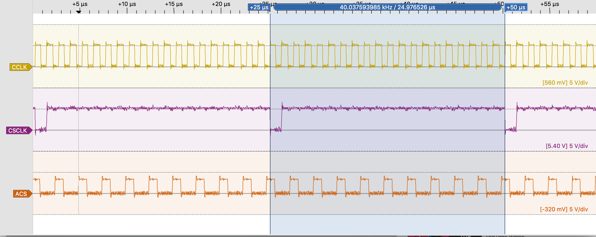
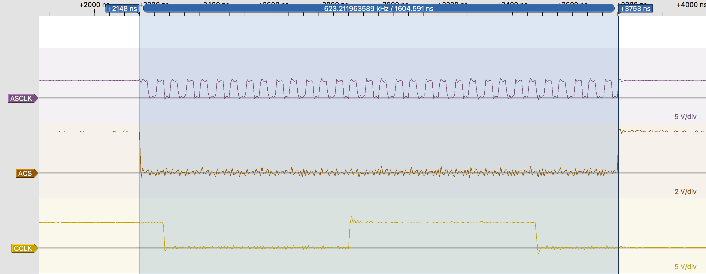
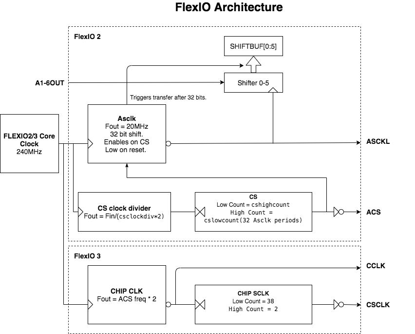

# Firmware for Reading the BNKChipV4_E100 README
Started by Nathan Zimmerberg on 19 JUL 2020

**Authors** Nathan Zimmerberg (nhz2@cornell.edu)

Latest Revision: 07 AUG 2020

## Overview

The main goal of the firmware is to:

1. Setup a recording from the BNKChipV4_E100 with a specified framerate, reference electrode voltage(Vref), and number of frames. 
2. Run the recording. Generate the signals to drive the chip and analog to digital converters (ADC). Stream the data from the ADCs into an SD card.
3. Send the final data to the attached computer via USB, along with any errors that occurred.

## Hardware Overview

### Links

Micro controller - [Teensy 4.1](https://www.pjrc.com/teensy/)

Analog to digital converter - [AD7866](https://www.analog.com/media/en/technical-documentation/data-sheets/AD7866.pdf)

100 electrode array chip - [BNKChipV4_E100 vague paper](https://doi.org/10.1016/j.bios.2012.09.058)

Digital to analog converter - [DAC80501](https://www.ti.com/lit/ds/symlink/dac80501.pdf)

[Schematic and PCB layout](https://easyeda.com/nzimmerberg/amp-chip)

## External Signals During a Recording

During a recording, the following external signals change. Everything else on the board should be DC.


These are the two signals going into the BNKChip from the teensy 4.1.

CCLK is the clock, and CSCLK is a signal to start a new frame. CCLK clocks in CSCLK and clocks out the analog data on its falling edge. 

Here is what the signals should look like (note: the teensy logic level is 3.3V and the chip logic level is 5V, so there is a logic level converter between them).


### Scope Traces at 40kHz Framerate






## Background Tasks During a Recording 

https://github.com/wramsdell/TriantaduoWS2811 is a project that I used as a working 
example that uses DMA and FlexIO to do high speed IO on a teensy 4. 
This library outputs data, while I am inputting data, but the main use of DMA and FlexIO
are similar. The documentation below is also modeled on TriantaduoWS2811's readme.

### Global Variables and Functions

The background tasks have an interface of global variables and functions.


`double setupflexio(double freq)`: Setup flexIO at freq in Hz greater than 250.
returns the real frequency in Hz of reading a frame.

`void closeflexio()`: Disable the flexIO.

`void setupflexiodma()`: Setup DMA from FLEXIO2. Do this before calling `setupflexio`

Frame data struct.

```
struct Frame
{
  /** The frame number(starting at 0). This increases at 
      the real framerate even if some frames are skipped.*/
  uint32_t framenumber;
  
  /** The raw data from the ADCs. framedata[0] is row 0, ADC1, 
      framedata[1] is row 0, ADC2 ...*/
  uint32_t framedata[60];
  
  uint32_t userdata0;
  uint32_t userdata1;
  uint32_t crc;
};
```

`const uint32_t framefifo::buffersize`: Total number of frames that can be stored in the fifo.

`uint32_t framefifo::framestoread()`: How many frames can be read till empty.

`uint32_t framefifo::framestowrite()`: How many frames can be written till full with no overflow.

`void framefifo::push(Frame frame)`: Push 1 frame to the the fifo, used by the ISR.

`Frame framefifo::pop()`: Pop 1 frame from the the fifo.

`volatile int32_t userdata0`: Userdata written to the frames in the ISR.

`volatile int32_t userdata1`: Userdata written to the frames in the ISR.

`const uint32_t framesize = 256;// frame size in bytes`

`volatile uint32_t framecount;`: Number of frames read, updated by `dmaisr`

`volatile uint32_t skippedframes;`: Number of frames not written to `framebuffer` because of overflow. Should be zero if all the data is correctly saved.

### FlexIO

FlexIO is a collection of interconnected shift registers, timers, and pins in the teensy.
It is described in detail in the [processor reference manual](https://www.pjrc.com/teensy/IMXRT1060RM_rev2.pdf)

The FlexIO inputs the data from the six ADCs into six 32bit shift buffers and requests a DMA.

The FlexIO also outputs the clocks and syncs for the ADCs and chip.

The FlexIO is setup in `double setupflexio(double freq)` in the `flexiodmaisr` library.
This sets up the FlexIO at a requested frame rate `freq` in Hz. It also returns the real frame rate used.



### DMA

The DMA is setup by `setupflexiodma()` in the `flexiodmaisr` library.

The DMA is triggered every ADC read. It transfers the bit reversed shift buffers 
into a large (64 kB) circular buffer.

### Interrupt

Every `numframesinterrupt` frames the DMA transfers, `dmaisr` is called.

This interrupt packs the raw frame data in the DMA circular buffer and puts it onto the 
frame circular buffer. It also checks if the frame circular buffer is full, and if it is, it turns on the blue LED, and skips the frames.


### Status and Error Detection

The most likely error to occur is a frame buffer overflow. This happens because the
 frames are not being sent off chip fast enough, or there is some latency issue. 
If this happens new frames will not be written to the buffer until it has more space. Also, the blue LED will light, and global `skippedframes` will increase from zero.

For the flexIO, if the DMA doesn't read the shifter buffer fast enough, `IMXRT_FLEXIO2_S.SHIFTERR` won't be 0x00 (this shouldn't ever be an issue).


## SDFAT

SdFat by greiman from https://github.com/greiman/SdFat-beta is the SD card library I am using. It is included in the `libraries` directory.

## DAC

There is a DAC that sets the reference electrode voltage.

## RGB LED

The RGB LED turns blue on if frames are skipped (probably because the SD card writing
is too slow)

The RGB LED blinks red if there is a fatal error with the SD card or flexIO. If this happens power cycle the device.

The RGB LED green is on during a recording.

## Serial Protocol

The serial protocol is command and response where the PC is the commander and the device is the responder.
All commands end with a newline.
The device will finish a response with `"a\n"` when it is ready for a new command.

### NOP command:

    `"a\n"`
    
response:

    `"a\n"`

### DAC set voltage command:

    d<voltage(V)>
    
example:

    `"d0.743\n"`
    
response:

    `"a\n"`

### Recording start command:

    r<frame rate(Hz)>,<number of frame chunks(32 frames)>,<aux channel(1 or 2)>,<range(0 is 0V-2.5V and 1 is 0V-5V)>,<userdata0>,<userdata1>
    
example:

    `"r40000.0,131072,2,1,-55,109\n"`
    
response:

    real frame rate(Hz)
    
example:

    `"40000.00\na\n"`

### Status command:

    `"s\n"`
    
response:

    <1 if recording and 0 if not recording>,<frame chunks saved>,<frames skipped>,<last saved frame(256 bytes of raw data)>
    
example:

    `"1,115360,0,�S8......\na\n"`
    
### Eject card command: 

    This aborts the reading and closes the SD card file.
    
example:

    `"e\n"`
    
response:

    `"a\n"`

### Frame chunk readout command:

    f<chunk id(starts at 0)>
    
example:

    `"f100\n"`
    
response:

    256*32 bytes of raw data and a new line and ack.
    
example:

    `"fajknj.......\na\n"`
    
    
